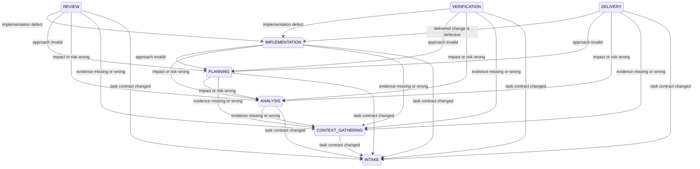

# Agent Thread Orchestrator Protocol

## Status and scope

This document is the normative runtime protocol for one orchestrator agent thread handling one dependency-ready task.

The upstream task queue, cross-task scheduling, merge queue, remote CI, and merging are outside this version's scope. The task queue may run many orchestrator threads in parallel, but each thread owns exactly one task-state-machine instance and uses a single implementer.

`orchestrator.html` is a visual companion. If it disagrees with this document, this document wins.

## Core model

The system combines a state machine with a simple actor model:

- The task occupies exactly one canonical lifecycle at a time.
- Only the orchestrator may commit lifecycle transitions.
- The router is part of the orchestrator's control plane. It selects a permitted outgoing edge; it is not a lifecycle.
- Worker actors perform bounded lifecycle work and return structured results. They cannot change lifecycle state, spawn actors, or delegate work.
- Parallel work is allowed only for independent planners. Implementation is single-threaded.
- Actor invocations are disposable. Canonical artifacts and task state are persistent.

## Authority boundaries

| Role | Responsibility | Mutation authority |
| --- | --- | --- |
| Orchestrator | Dispatch actors, invoke the router, persist state, enforce invariants | Task record only |
| Intake actor | Normalize the request into a task contract | Read-only |
| Context gatherer | Collect grounded repository and runtime evidence | Read-only |
| Analyst | Assess impact, regression scope, risk, and verification needs | Read-only |
| Planner | Produce a candidate or canonical plan | Read-only |
| Plan synthesizer | Merge independent candidate plans into one canonical plan | Read-only |
| Implementer | Execute the canonical plan | Approved task workspace |
| Reviewer | Independently review a plan or implementation | Read-only |
| Verifier | Independently gather acceptance and regression evidence | No intentional source changes; ephemeral build/test outputs are allowed |
| Deliverer | Commit, push, and create or update the PR | Delivery side effects only; no implementation changes |

The reviewer and verifier must be fresh invocations independent from the implementer. They receive canonical task artifacts and the actual change, not the implementer's private reasoning.

## Lifecycle inventory

| Lifecycle | Purpose | Required canonical output |
| --- | --- | --- |
| `INTAKE` | Normalize objective, scope, authority, and definition of done | Task contract |
| `CONTEXT_GATHERING` | Ground the task in repository, documentation, history, and runtime evidence | Context evidence package |
| `ANALYSIS` | Determine impact, regression scope, blast radius, risk, and verification needs | Impact report and visual impact artifacts |
| `PLANNING` | Select and describe one executable approach | Canonical implementation plan |
| `IMPLEMENTATION` | Execute the canonical plan with one implementer | Implementation result and change set |
| `REVIEW` | Independently assess a plan or implementation | Review result |
| `VERIFICATION` | Prove acceptance criteria and regression expectations | Verification result |
| `DELIVERY` | Publish the verified revision as a PR | Delivery result |
| `AWAITING_INPUT` | Suspend until required human or external input arrives | Pause reason and resume condition |
| `COMPLETED` | Record successful terminal completion | Terminal result |
| `CANCELLED` | Record authorized terminal cancellation | Cancellation result |

`ROUTER`, `BLOCKED`, `REWORK`, and `FAILED` are not lifecycles. Blocking is a reason to enter `AWAITING_INPUT`; failures are events handled by routing; rework uses backward edges.

## Lifecycle contract

Every active lifecycle defines:

1. **Entry guard** — what must already be true.
2. **Actor work** — the bounded work assigned by the orchestrator.
3. **Required output** — the structured canonical artifact or result.
4. **Exit gate** — evidence the router must confirm before selecting an outgoing edge.

An actor saying it is finished never satisfies an exit gate by itself.

### `INTAKE`

**Entry guard:** A dependency-ready task has been assigned to the thread, or the task contract changed.

**Actor work:** Normalize the request without inventing authority or requirements.

**Required output — task contract:**

- objective
- acceptance criteria
- in-scope and out-of-scope boundaries
- constraints and prohibitions
- granted authority and required approvals
- expected deliverable
- known dependencies and assumptions

**Exit gate:** The contract is actionable, or remaining questions can be investigated during context gathering. Material ambiguity that cannot be investigated routes to `AWAITING_INPUT`.

### `CONTEXT_GATHERING`

**Entry guard:** A current task contract exists.

**Actor work:** Gather only context relevant to the contract.

**Required output — context evidence package:**

- relevant files, symbols, tests, documentation, and history
- applicable repository instructions and architectural decisions
- current behavior and reproducible observations
- dependencies and integration boundaries
- unresolved unknowns
- source references for every material claim

**Exit gate:** Enough grounded evidence exists to assess impact. Otherwise retry with changed conditions, return to `INTAKE` for a contract problem, or enter `AWAITING_INPUT`.

### `ANALYSIS`

**Entry guard:** A current context evidence package exists.

**Actor work:** Analyze the proposed change in the context of the whole affected system.

**Required output — impact report:**

- affected and potentially affected surfaces
- callers, consumers, dependencies, and integration boundaries
- regression scope and blast-radius rating
- risk and scope classifications
- required review and verification depth
- unresolved uncertainties

**Required visual artifacts:**

1. **System impact graph** — changed area, upstream callers, downstream dependencies, data stores, external systems, and affected boundaries.
2. **Change-surface matrix** — affected area, impact type, risk, expected modification, and regression concern.
3. **Verification map** — acceptance criteria and risks mapped to the checks that will prove them.

Trivial tasks may use a one-node graph or one-row table. A manually requested richer visual should be produced even when the default would be minimal.

**Exit gate:** The impact, risk, scope, and required verification are explicit and supported by evidence.

### `PLANNING`

**Entry guard:** A current impact report and visual artifacts exist.

**Actor work:** Produce one canonical executable plan.

**Required output — canonical plan:**

- chosen approach and rationale
- ordered implementation steps
- expected files or components affected
- acceptance-criteria mapping
- risk and regression mitigations
- verification steps
- assumptions and unresolved concerns

#### Planning modes

Use a single planner by default.

Use two isolated planners followed by one `high_reasoning` synthesizer when any of these is true:

- risk is `high`
- confidence is `low`
- a previous canonical plan failed review or implementation

Parallel planners receive the same task contract and approved evidence package but not each other's outputs. The synthesizer receives both candidates and produces one canonical plan. Candidate plans remain supporting evidence; downstream actors receive only the canonical plan.

If canonical-plan confidence remains `low`, route to `REVIEW` with `review_target: plan`.

**Exit gate:** Exactly one canonical plan exists and is consistent with the task contract and impact report.

### `IMPLEMENTATION`

**Entry guard:** A current canonical plan exists and the task requires changes.

**Actor work:** One implementer executes the plan within the approved scope.

**Required output — implementation result:**

- completed plan steps
- changed files and components
- tests added or updated
- deviations from the plan and their rationale
- newly discovered risks, dependencies, or scope
- local checks performed
- remaining known issues

**Exit gate:** The implementation is complete enough for independent review, and no discovery has invalidated an earlier canonical artifact. Material discoveries route backward to their owning lifecycle.

### `REVIEW`

**Entry guard:** A reviewable canonical plan or implementation revision exists.

**Actor work:** A reviewer independent from the implementer inspects the full target and reports all findings in one result.

**Required output — review result:**

- review target and revision
- all findings, classified by severity and owning lifecycle
- correctness and maintainability assessment
- acceptance-criteria coverage
- regression and system-impact assessment
- reconciliation of the predicted impact graph and change-surface matrix with the actual change
- uncertainties and missing evidence
- outcome: `approved`, `changes_required`, or `inconclusive`

After fixes, a fresh review inspects the full resulting change again. Repeated non-convergence uses the ordinary retry and escalation policy.

**Exit gate:** The target is approved with adequate confidence and no unresolved blocking finding.

### `VERIFICATION`

**Entry guard:** The applicable review gate passed, or the task requires no implementation.

**Actor work:** A verifier independent from the implementer gathers authoritative evidence.

**Required output — verification result:**

- acceptance criteria checked
- regression risks checked
- commands, tests, builds, or scenarios executed
- `pass`, `fail`, or `unavailable` for each check
- evidence references
- checks not performed and why
- completed verification map

**Exit gate:** Every required check has passing evidence or an explicitly accepted exception, and the evidence matches the final revision.

### `DELIVERY`

**Entry guard:** Verification passed for the final change and a PR is required.

**Actor work:** Commit if needed, push, and create or update the PR without modifying implementation content.

**Required output — delivery result:**

- branch and commit reference
- PR URL and identifier
- PR title and summary
- acceptance criteria and verification evidence included in the description
- known limitations or deferred work
- confirmation that the PR references the reviewed and verified revision

Remote CI is outside v1's completion gate.

**Exit gate:** The PR exists and references the exact locally reviewed and verified change.

### `AWAITING_INPUT`

**Entry guard:** Required authority, credentials, approval, product decision, or irreducible information is unavailable.

**Required output:** The pause reason, question or dependency, suspended artifact, and resume condition.

When input arrives, the router reevaluates the task and chooses the appropriate permitted lifecycle. It does not blindly resume the prior actor.

### Terminal lifecycles

`COMPLETED` and `CANCELLED` have no outgoing edges.

Cancellation requires an explicit authorized cancellation event. Actor failure, uncertainty, or exhausted retries must not imply cancellation.

## State machine

### Primary flow

```mermaid
stateDiagram-v2
    [*] --> INTAKE
    INTAKE --> CONTEXT_GATHERING: task contract ready
    CONTEXT_GATHERING --> ANALYSIS: evidence sufficient
    ANALYSIS --> PLANNING: impact understood

    PLANNING --> REVIEW: plan confidence remains low
    REVIEW --> IMPLEMENTATION: plan approved; change required
    REVIEW --> VERIFICATION: plan approved; no change required

    PLANNING --> IMPLEMENTATION: change required
    PLANNING --> VERIFICATION: no change required
    IMPLEMENTATION --> REVIEW: implementation ready
    REVIEW --> VERIFICATION: implementation approved

    VERIFICATION --> DELIVERY: verification passed; PR required
    VERIFICATION --> COMPLETED: verification passed; no delivery
    DELIVERY --> COMPLETED: PR created

    COMPLETED --> [*]
    CANCELLED --> [*]
```



`REVIEW` is parameterized by `review_target: plan | implementation`. The target and task type disambiguate its permitted forward edge.

### Backward and retry edges



Every active work lifecycle also has a guarded self-transition named `retry`. It is allowed only when the prior attempt was unsuccessful or inconclusive, at least one execution condition changes, and the retry limit is not exceeded.

### Global suspension and cancellation edges

For every active lifecycle in:

`INTAKE`, `CONTEXT_GATHERING`, `ANALYSIS`, `PLANNING`, `IMPLEMENTATION`, `REVIEW`, `VERIFICATION`, `DELIVERY`

the following edges are permitted:

```text
ACTIVE_LIFECYCLE -> AWAITING_INPUT
ACTIVE_LIFECYCLE -> CANCELLED
AWAITING_INPUT -> ACTIVE_LIFECYCLE
```

`AWAITING_INPUT -> ACTIVE_LIFECYCLE` is permitted only after new input arrives and the router reevaluates which lifecycle owns the newly unblocked work. `AWAITING_INPUT -> CANCELLED` is also permitted on authorized cancellation.

These templates are part of the closed transition set; no other edges are allowed.

## Backward-edge ownership rule

Route to the earliest lifecycle responsible for the invalid assumption or artifact:

| Finding | Destination |
| --- | --- |
| Objective, acceptance criteria, scope, authority, or deliverable changed | `INTAKE` |
| Required fact or evidence is missing, stale, or incorrect | `CONTEXT_GATHERING` |
| Impact, regression scope, blast radius, risk, or verification need is incorrect | `ANALYSIS` |
| The selected solution approach is invalid | `PLANNING` |
| The implementation is defective | `IMPLEMENTATION` |

When routing backward, mark dependent downstream artifacts `stale`. Regenerate only invalidated work, then pass all applicable downstream gates again.

## Router

### Trigger events

Invoke the router only after:

- an actor returns a result
- an actor run is interrupted
- new user or external input arrives
- explicit cancellation arrives
- restart recovery begins

Do not transition while an actor is still running.

### Decision precedence

The router evaluates in this order:

1. hard invariants and safety gates
2. the closed transition allowlist and its guards
3. configured task policy
4. model judgment when rules do not resolve one edge
5. `AWAITING_INPUT` when material ambiguity remains

The router may never invent an edge.

If deterministic rules do not select exactly one valid edge, run one `high_reasoning` routing evaluation over the same persisted evidence. If ambiguity remains, enter `AWAITING_INPUT`.

### Routing signals

Use only these signals in v1:

| Signal | Values | Meaning |
| --- | --- | --- |
| Risk | `low`, `medium`, `high` | Consequence and blast radius |
| Confidence | `low`, `medium`, `high` | Strength and completeness of evidence |
| Scope | `local`, `cross-system` | Structural reach |
| Attempt count | integer | Consecutive failures for the same issue in the same lifecycle |

#### Risk

- `low`: localized, reversible, known behavior, narrow regression scope
- `medium`: user-visible or multi-component change with bounded impact
- `high`: cross-system behavior, security/auth, sensitive data, migrations, public contracts, irreversible effects, or broad/uncertain blast radius

Choose the highest applicable risk.

#### Confidence

- `high`: direct evidence supports material claims and important unknowns are resolved
- `medium`: the approach is supported, with minor assumptions or coverage gaps
- `low`: important behavior is inferred, evidence conflicts, or material unknowns remain

Actors report confidence with reasons. The router may lower confidence but may not raise it without new evidence.

#### Scope

- `local`: contained within one bounded component or tightly coupled module group, with no external contract change
- `cross-system`: crosses service, package, domain, process, persistence, queue, or external API boundaries

### Model policy

V1 defines two abstract tiers:

- `standard`
- `high_reasoning`

Use `high_reasoning` when any of these is true:

- risk is `high`
- confidence is `low`
- scope is `cross-system`
- the same unresolved issue already caused one failed attempt
- parallel plans are being synthesized

Otherwise use `standard`. Concrete model names are configured outside this protocol.

Escalation is proactive for high-risk or uncertain work and reactive after failure. For the same unresolved issue, do not return to a lower tier without an explicit reason.

### Retry policy

Allow at most two consecutive failed attempts for the same issue in the same lifecycle:

1. First attempt uses the tier selected by policy.
2. Second attempt changes at least one condition and uses `high_reasoning`.
3. After a second failure, route to an earlier responsible lifecycle or `AWAITING_INPUT`.

A changed condition may be new evidence, corrected context, a different strategy, different tools, or a higher model tier. Blind retries are forbidden.

### Router result

Every routing decision returns and persists:

- selected next lifecycle
- edge identifier
- guard that passed
- concise rationale
- invalidated artifacts, if any
- next actor role and model tier
- planning mode when entering `PLANNING`: `single` or `parallel`

Conceptually:

```text
event + current task record
  -> evaluate invariants
  -> enumerate permitted outgoing edges
  -> evaluate guards
  -> select exactly one edge or escalate ambiguity
  -> persist decision and new lifecycle
  -> dispatch next actor
```

## Actor result envelope

Every actor invocation returns:

```yaml
invocation_id: stable identifier
role: actor role
lifecycle: lifecycle worked
outcome: succeeded | failed | blocked | inconclusive
confidence: low | medium | high
summary: concise result
evidence: []
artifacts: []
acceptance_criteria:
  addressed: []
  unaddressed: []
issues: []
risks: []
assumptions: []
blockers: []
recommended_follow_up: []
recommended_model_tier: standard | high_reasoning
```

Recommendations are evidence for the router. They are not transition commands.

## Persistence and recovery

### Minimal task record

```yaml
task_id: stable identifier
state: current lifecycle
revision: monotonic task revision
task_contract: reference
artifacts:
  context: reference
  analysis: reference
  impact_graph: reference
  change_surface_matrix: reference
  verification_map: reference
  plan: reference
  implementation: reference
  review: reference
  verification: reference
  delivery: reference
active_invocation: reference | null
attempt_count: integer
last_route: reference
transition_history: []
terminal_result: reference | null
```

Large artifacts live separately and are referenced by the task record.

### Transition ordering

For restart safety:

1. Persist the actor result.
2. Evaluate the router.
3. Atomically persist the routing decision and new lifecycle.
4. Dispatch the next actor.

If restart occurs before step 3, reevaluate the persisted result. If it occurs after step 3, resume from the persisted lifecycle.

### Interrupted actors

V1 does not reattach to actor runs:

- Persist state before and after every invocation.
- On restart, mark a mid-run invocation `interrupted` and create a fresh attempt.
- Before repeating commit, push, or PR creation, inspect whether the side effect already succeeded.

## Completion invariants

The router may commit `COMPLETED` only when:

- the current task contract and acceptance criteria are satisfied
- no required canonical artifact is missing or stale
- applicable implementation review passed
- authoritative verification passed
- verification evidence matches the final revision
- when delivery is required, the PR exists for that revision
- no unresolved blocker or required approval remains

For a normal code-changing task:

```text
INTAKE
  -> CONTEXT_GATHERING
  -> ANALYSIS
  -> PLANNING
  -> IMPLEMENTATION
  -> REVIEW
  -> VERIFICATION
  -> DELIVERY
  -> COMPLETED
```

For a no-change task:

```text
INTAKE
  -> CONTEXT_GATHERING
  -> ANALYSIS
  -> PLANNING
  -> VERIFICATION
  -> COMPLETED
```

## Example backward loop

1. `VERIFICATION` finds a localized implementation defect.
2. The router classifies the finding as implementation-owned.
3. The router invalidates the implementation review and verification artifacts.
4. The task transitions `VERIFICATION -> IMPLEMENTATION`.
5. The implementer fixes the defect.
6. The full resulting implementation passes through `REVIEW` again.
7. A fresh verifier reruns the required verification map.
8. The task proceeds to `DELIVERY` only after verification passes.

If instead verification reveals an incorrect blast-radius assumption, the permitted edge is `VERIFICATION -> ANALYSIS`, followed by regeneration of the plan and all applicable downstream artifacts.

