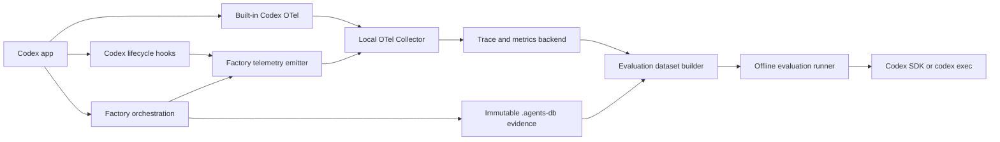

# Telemetry and Evaluation Plan

## Objective

Add telemetry and evaluations to the software factory while keeping the Codex
app as the interactive orchestration harness.

The system must make agent runs observable and comparable without allowing
telemetry, historical records, or evaluation results to mutate canonical task
state. Improvements discovered through telemetry and evaluations must pass
through the normal reviewed factory workflow.

## Core model

Keep 3 separate data planes:

1. **Canonical control plane**
   - Current lifecycle and task revision
   - Active invocation
   - Latest canonical handoff
   - Pending and approved transition
   - State required for deterministic resume
2. **Immutable evidence plane**
   - Lifecycle checkpoint snapshots
   - Router decisions and approval dispositions
   - Analysis, review, verification, and delivery artifacts
   - Human-readable lifecycle timeline
   - Git and change-assurance evidence
3. **Telemetry and evaluation plane**
   - Traces, spans, events, logs, and metrics
   - Human annotations
   - Versioned evaluation datasets
   - Candidate-versus-baseline experiment results
   - Dashboards and alerts

Canonical routing reads only the control plane. The other planes may provide
diagnostic evidence and improvement proposals, but they are not alternate
sources of current task state.



## Codex app integration

### Built-in OpenTelemetry

Use Codex's opt-in OpenTelemetry support for runtime-level observations:

- conversation start;
- model, reasoning, sandbox, and approval configuration;
- API, SSE, and WebSocket requests;
- token usage and request duration;
- tool calls and duration;
- tool approval or denial;
- tool results and failures;
- redacted user-prompt metadata.

Configure telemetry in user-level `~/.codex/config.toml`. Project-level
`.codex/config.toml` cannot override telemetry routing.

Start with a local collector:

```toml
[otel]
environment = "dev"
log_user_prompt = false

exporter = { otlp-http = {
  endpoint = "http://127.0.0.1:4318/v1/logs",
  protocol = "binary"
}}

metrics_exporter = { otlp-http = {
  endpoint = "http://127.0.0.1:4318/v1/metrics",
  protocol = "binary"
}}

trace_exporter = { otlp-http = {
  endpoint = "http://127.0.0.1:4318/v1/traces",
  protocol = "binary"
}}
```

Keep `log_user_prompt = false` until a redaction, access-control, and retention
policy explicitly permits content collection.

Codex product analytics are independent from user-configured OTel export. They
can be disabled separately:

```toml
[analytics]
enabled = false
```

### Codex hooks

Use hooks to correlate Codex sessions and tools with factory tasks:

- `SessionStart` and `SessionEnd`
- `UserPromptSubmit`
- `PreToolUse` and `PostToolUse`
- `PermissionRequest`
- `SubagentStart` and `SubagentStop`
- `PreCompact` and `PostCompact`
- `Stop`

Hook input provides the Codex session ID, optional turn ID, working directory,
model, permission mode, and event-specific data. A hook command should:

1. Read its JSON input from stdin.
2. Resolve the project and branch from `cwd`.
3. Resolve the active branch-task root under `~/.agents-db`.
4. Read the current factory task and revision when available.
5. Emit a structured event to a local spool or OTel Collector.
6. Return no model-visible content during normal operation.

Hooks enrich the built-in Codex telemetry. They do not replace it because some
hosted or specialized tool paths may not pass through tool hooks.

Non-managed hooks require explicit review and trust before Codex runs them.

### Codex App Server boundary

Do not depend on attaching an observer to the desktop app's internal App Server
connection. That is not a documented extension point.

App Server remains an option if the factory later needs a custom Codex client
with direct access to:

- thread, turn, and item events;
- command, file-change, MCP, and dynamic-tool items;
- subagent collaboration events;
- compaction and model rerouting;
- approval requests;
- token-usage updates;
- final turn status.

The initial implementation should retain the Codex app UI and use supported
OTel and hook interfaces.

## Factory telemetry model

### Trace hierarchy

Use 1 trace for each complete factory task:

```text
factory.run
├── factory.lifecycle.visit
│   ├── factory.actor.invocation
│   │   ├── gen_ai.client.operation
│   │   ├── factory.tool.call
│   │   └── factory.artifact.write
│   └── factory.checkpoint.commit
├── factory.route.evaluate
├── factory.approval
├── factory.lifecycle.visit
│   └── ...
├── factory.verification
└── factory.delivery
```

Use OpenTelemetry and OTLP for transport and common runtime concepts. Keep
factory lifecycle semantics under a stable `factory.*` namespace. Current
OpenTelemetry GenAI conventions remain under development, so record the
convention version and isolate mappings from the stable factory schema.

### Required identifiers

Capture:

- `trace_id`, `span_id`, and `parent_span_id`;
- `factory.run_id`;
- Codex session and turn IDs;
- task, project, branch, and task revision;
- lifecycle and lifecycle-visit sequence;
- actor invocation ID;
- checkpoint and route sequence;
- artifact path and manifest checksum;
- Git base, head, and dirty-worktree status.

### Required version dimensions

Capture:

- Codex application and runtime version;
- orchestrator and skill versions;
- prompt and instruction hashes;
- model provider, model snapshot, reasoning effort, and worker profile;
- tool schema and plugin versions;
- policy and configuration hash;
- repository commit;
- evaluation suite, dataset, grader, and harness versions;
- environment or container image.

### Required timing and usage data

Capture when available:

- start, end, queue time, and duration;
- API, model, and tool latency;
- input, output, cached, and reasoning tokens;
- estimated cost;
- turns, tool calls, retries, and context compactions;
- files and lines changed;
- tests executed and test duration.

### Required outcomes

Capture:

- success, failure, blocked, interrupted, cancelled, or inconclusive;
- structured error classification;
- lifecycle exit-gate result;
- every evaluated route guard and evidence reference;
- selected route and concise evidence-backed rationale;
- approval disposition;
- review and verification outcome;
- externally verified repository, PR, or delivery state.

Do not collect private chain-of-thought. Persist concise decision factors,
evidence, alternatives, and rationale sufficient to audit the route.

## Factory event catalog

Emit structured events from deterministic persistence and transition commands:

- `factory.task.started`
- `factory.lifecycle.entered`
- `factory.actor.started`
- `factory.actor.completed`
- `factory.artifact.written`
- `factory.checkpoint.committed`
- `factory.route.evaluated`
- `factory.route.proposed`
- `factory.route.committed`
- `factory.route.rejected`
- `factory.approval.requested`
- `factory.approval.resolved`
- `factory.compaction.completed`
- `factory.recovery.completed`
- `factory.verification.completed`
- `factory.delivery.completed`
- `factory.task.completed`
- `factory.task.cancelled`

Events should reference immutable artifacts instead of copying full artifact
content:

```json
{
  "event": "factory.route.committed",
  "factory_run_id": "run_789",
  "task_id": "task_123",
  "task_revision": 2,
  "checkpoint_sequence": 8,
  "route_sequence": 7,
  "from": "REVIEW",
  "to": "IMPLEMENTATION",
  "reason": "Blocking correctness defect F1",
  "record": "history/routes/000007-review--implementation/decision.md",
  "record_sha256": "<digest>"
}
```

## Storage and correlation

### Machine-queryable telemetry

Use:

- a local append-only JSONL spool as a recoverable buffer;
- OTLP export to an OTel Collector;
- a trace backend for interactive inspection;
- a metrics backend for dashboards and alerts;
- columnar exports such as Parquet for offline analysis.

Codex runtime events and factory events should share:

- Codex session and turn IDs;
- factory run and task IDs;
- repository and branch;
- Git commit;
- actor invocation ID when applicable.

### Immutable evidence

Keep full material under `~/.agents-db`:

- checkpoint snapshots;
- route decisions and dispositions;
- lifecycle timeline;
- task contracts and plans;
- analysis and change-assurance reports;
- review and verification results;
- test output and supporting artifacts.

Telemetry contains identifiers, measurements, outcomes, classifications, and
artifact hashes. The immutable evidence store contains the complete material
needed to understand a run.

## Initial metrics

### Quality

- task completion rate;
- first-pass review approval rate;
- verification pass rate;
- regression escape, revert, or follow-up defect rate;
- behavioral-path evidence coverage;
- human approval rejection rate.

### Routing

- lifecycle visits per task;
- transition frequency;
- implementation/review loop count;
- route reversal rate;
- invalid or inconclusive routing rate;
- model-tier escalation rate;
- time spent awaiting input.

### Reliability

- actor failure and interruption rate;
- checkpoint or history reconciliation failure rate;
- deterministic resume success rate;
- tool error and retry rate;
- artifact checksum or stale-state failure rate.

### Efficiency

- wall time, tokens, and cost by lifecycle;
- tool calls per task;
- repeated repository reads;
- rework cost as a percentage of total cost;
- cost and time per successfully verified task.

Segment metrics by task class, risk, scope, model, protocol version, repository,
and task complexity.

## Evaluation model

### Evaluation layers

| Layer | Measures | Preferred grader |
| --- | --- | --- |
| Protocol invariants | Legal transitions, approvals, checkpoint ordering, canonical/history separation | Deterministic code |
| Outcome correctness | Tests, files, Git state, PR, delivery, acceptance criteria | Deterministic environment checks |
| Routing quality | Whether evidence supports the selected edge | Expert labels and calibrated narrow model grader |
| Artifact quality | Contract, analysis, plan, review, and assurance completeness | Schema checks and focused rubric |
| Agent trajectory | Tool choice, prohibited effects, retries, and duplicate work | Trace rules and calibrated model grader |
| Efficiency | Time, cost, tokens, calls, and rework | Numeric comparison |
| Safety and privacy | Secret leakage, permission violations, unsafe tools | Deterministic scanners and adversarial cases |
| Product quality | Whether the delivered change solves the task well | Human or domain-specific rubric |

Use deterministic graders first. Use model graders only for qualities that
cannot be checked reliably in code. Calibrate model graders against expert
labels and keep each rubric focused on 1 dimension.

### Dataset construction

Create the first dataset from 20–50 historical runs:

- successful first-pass runs;
- implementation/review loops;
- incorrect or reversed routes;
- interrupted and resumed runs;
- high-risk tasks;
- missing-evidence cases;
- human-rejected routes;
- unusually expensive or slow runs.

For every case:

1. Redact sensitive content.
2. Pin the repository commit and environment.
3. Pin the factory, skill, prompt, model, and configuration versions.
4. Label task class, risk, scope, and difficulty.
5. Define the externally observable expected outcome.
6. Define separate correctness, routing, safety, and efficiency graders.
7. Keep some cases in a private holdout dataset.

A later lifecycle reversal is evidence for investigation, not automatic proof
that the earlier route was wrong. Promote it to a regression case only after
human causal review.

### Evaluation execution

Use Codex app runs to discover and curate evaluation cases. Run repeatable
experiments through:

- `codex exec --json`;
- the Codex TypeScript or Python SDK;
- App Server only if a custom client becomes necessary.

For every experiment:

1. Create a disposable worktree at the pinned repository commit.
2. Load the pinned baseline or candidate factory configuration.
3. Disable delivery and unrelated external side effects.
4. Run the task with explicit sandbox and approval policy.
5. Capture Codex JSONL, OTel telemetry, and factory artifacts.
6. Verify the resulting repository and external state.
7. Compare candidate and baseline per case.
8. Repeat important nondeterministic cases for several trials.

Do not rely only on aggregate averages. Preserve per-case traces and compare
quality, safety, latency, cost, and variance independently.

## Improvement loop

1. Capture every run structurally.
2. Monitor reliability, quality, routing, latency, and cost.
3. Sample failures, low-scoring runs, and a random control group.
4. Have humans classify the actual failure.
5. Promote confirmed failures into a versioned evaluation dataset.
6. Change 1 model, prompt, skill, or policy variable.
7. Run candidate and baseline against the same pinned cases.
8. Review per-case regressions and aggregate changes.
9. Require hard gates for safety, illegal transitions, corruption, and known
   regression cases.
10. Require human review for subjective score changes until graders are
    calibrated.
11. Canary the candidate.
12. Continue monitoring and add newly confirmed failures to the dataset.

## Privacy, security, and retention

- Collect structural metadata for all runs.
- Keep raw prompt and response capture disabled by default.
- Redact before export, not only at the backend.
- Treat tool arguments, terminal output, source code, retrieved documents, and
  human comments as sensitive.
- Store artifact references and hashes instead of duplicating content.
- Use access controls and separate development, evaluation, and production
  environments.
- Define shorter retention for sampled content than for structural metrics.
- Support deletion by task, user, repository, and time range.
- Never export credentials, authentication tokens, cookies, or unredacted
  secrets.
- Record whether content was captured, redacted, sampled, or omitted.

## Delivery phases

### Phase 1: Structural telemetry

- Define and version the stable `factory.*` event schema.
- Run a local OTel Collector.
- Enable Codex OTel with prompt content disabled.
- Implement the local JSONL spool and OTLP exporter.
- Add Codex correlation hooks.
- Emit lifecycle, actor, checkpoint, route, approval, verification, and delivery
  events.
- Verify that OTel failure cannot corrupt or block canonical state persistence.

### Phase 2: Analysis

- Add lifecycle-path, reliability, cost, and latency dashboards.
- Add route-decision and failure annotations.
- Add artifact links from traces.
- Build the first 20–50-case dataset.
- Implement deterministic protocol and outcome graders.

### Phase 3: Regression evaluation

- Build candidate-versus-baseline execution with disposable worktrees.
- Add repeated trials for important cases.
- Add calibrated routing and artifact-quality graders.
- Add hard CI gates for safety, illegal transitions, persistence corruption,
  and confirmed regression cases.
- Produce a per-case and aggregate evaluation report for every factory change.

### Phase 4: Production learning

- Add sampled online quality evaluations.
- Add a human annotation queue.
- Detect failure clusters and task-distribution changes.
- Promote confirmed failures into versioned regression cases.
- Run controlled model, prompt, skill, and protocol experiments.
- Require normal factory review and verification before adopting an
  automatically proposed improvement.

## Acceptance criteria

- Codex app remains the interactive orchestration harness.
- Codex runtime telemetry reaches a controlled local collector.
- Factory lifecycle and routing events correlate with Codex sessions and turns.
- Canonical routing never reads telemetry or evaluation results as current
  state.
- Every telemetry event names its schema and relevant component versions.
- Full evidence remains recoverable from immutable artifact references.
- Prompt and tool content remains disabled or redacted by default.
- At least 20 representative cases form a versioned baseline dataset.
- Deterministic protocol and outcome graders run automatically.
- Candidate and baseline can run against the same pinned case and environment.
- Evaluation reports show per-case quality, safety, latency, cost, and variance.
- Confirmed production failures can be promoted into regression cases.

## Recommended initial tooling

- OpenTelemetry and OTLP for transport.
- Local JSONL spool for recoverability.
- OTel Collector as the ingestion boundary.
- DuckDB and Parquet for low-cost offline analysis.
- Arize Phoenix as an optional self-hosted first trace and evaluation UI.
- Codex SDK or `codex exec --json` for repeatable evaluation runs.

Keep raw vendor-neutral data and stable factory IDs even if a managed telemetry
or evaluation product is adopted later.

## References

- [Codex monitoring and telemetry](https://learn.chatgpt.com/docs/agent-approvals-security#monitoring-and-telemetry)
- [Codex configuration reference](https://learn.chatgpt.com/docs/config-file/config-reference)
- [Codex hooks](https://learn.chatgpt.com/docs/hooks)
- [Codex App Server](https://learn.chatgpt.com/docs/app-server)
- [Codex SDK](https://learn.chatgpt.com/docs/codex-sdk)
- [Codex non-interactive mode](https://learn.chatgpt.com/docs/non-interactive-mode)
- [OpenTelemetry GenAI semantic conventions](https://github.com/open-telemetry/semantic-conventions-genai)
- [OpenTelemetry GenAI metrics](https://github.com/open-telemetry/semantic-conventions/blob/main/docs/gen-ai/gen-ai-metrics.md)
- [OpenTelemetry GenAI attribute registry](https://opentelemetry.io/docs/specs/semconv/registry/attributes/gen-ai/)
- [OpenAI agent evaluations](https://developers.openai.com/api/docs/guides/agent-evals)
- [OpenAI trace grading](https://developers.openai.com/api/docs/guides/trace-grading)
- [Anthropic: Demystifying evals for AI agents](https://www.anthropic.com/engineering/demystifying-evals-for-ai-agents)
- [LangSmith evaluation concepts](https://docs.langchain.com/langsmith/evaluation-concepts)
- [LangSmith observability concepts](https://docs.langchain.com/langsmith/observability-concepts)
- [Arize Phoenix](https://arize.com/docs/phoenix)
- [Braintrust experiments](https://www.braintrust.dev/docs/evaluate/run-evaluations)
- [W&B Weave concepts](https://docs.wandb.ai/weave/concepts/what-is-weave)
