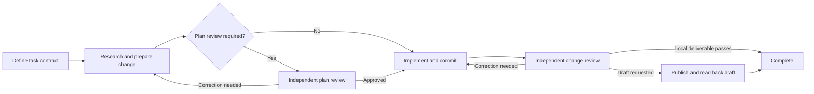

# Software factory research and assessment

Date: 8 September 2026.

**Recommendation: keep the current factory structure. Make its important rules enforceable before adding more automation.** The design already separates implementation from review. It preserves task state and binds acceptance evidence to Git revisions. These are useful foundations. The largest current weakness is that some rules exist only in instructions. The helper can accept records that bypass those rules.

The next investment should have two parts. First, repair stage validation, evidence coverage, checkpoint consistency, and task identity. Then improve how large work becomes small implementation tasks. Measure the results before changing worker models, supervision, or correction limits.

## Scope and evidence

This report compares nine public approaches to agent-assisted software production. It gives particular attention to Matt Pocock and Dex Horthy. Here, a software factory means a repeatable process that turns an accepted request into an implemented and verified change. A **runtime** is the code that executes and controls that process. A skill is an instruction document. A skill can describe a rule without making the runtime enforce it.

The local assessment covers all nine Factory skills, their Python helpers and tests, and the worker configurations. The inspected repository revision is `a6b8d77639e67f524b8f386a74a833382bab2aae`, which contains the September 7 checkpoint-outcome and evidence-validation changes. The worktree was clean before this report was created.

The session sample includes all four task roots found with top-level compact JSON contracts. I parsed all 63 checkpoint entries. I inspected the contracts, assurance structures, reports, and relevant findings. I also read the existing September 7 learning report to identify improvements that are already implemented. I did not follow its linked chat transcripts or treat its implementation request as a new instruction.

The assessment used three kinds of evidence:

- **Public source evidence:** first-party repositories, skill files, specifications, and engineering articles. These establish documented designs. They do not prove comparative productivity.
- **Local implementation evidence:** source inspection, 69 existing tests, and nine additional synthetic probes. Synthetic probes used temporary repositories or in-memory records.
- **Recorded execution evidence:** saved task results. These describe what the factory recorded. I did not rerun product builds, reopen tasks, publish changes, or verify remote delivery claims.

All 69 existing tests passed. Several additional probes exposed cases those tests do not cover. The [audit evidence file](/home/work/.agents/reports/evidence/2026-09-08-factory-audit.json) records the results, task sizes, and current validation errors.

## How other software factories work

These approaches solve different problems. Some provide small skills. Some provide a complete workflow. Others describe infrastructure used inside one company. Their public claims are not comparable benchmark results.

| Approach | Setup and operating model | Useful lesson for this factory |
| --- | --- | --- |
| **Matt Pocock's skills** | Install editable skills or a managed bundle. Configure the repository's tracker and documentation locations. Small skills cover clarification, specifications, implementation, testing, and review. The developer composes the process. [Repository](https://github.com/mattpocock/skills) | Keep the skills small. Separate reusable engineering practices from task routing. |
| **Dex Horthy and HumanLayer** | The original process separates research, planning, and implementation. The current product also presents questions, design, and structure work. Artifacts preserve decisions across agent sessions. Humans examine important decisions before implementation. [Context engineering essay](https://github.com/humanlayer/advanced-context-engineering-for-coding-agents/blob/main/ace-fca.md), [current HumanLayer workflow](https://www.hlyr.dev/) | Give important design decisions a clear, reviewable form. Adjust planning depth to the task. |
| **Jesse Vincent's Superpowers** | Install a skill bundle with runtime integration. Its workflow covers design discussion, worktree setup, small implementation tasks, tests, and separate reviews for requirements and code quality. [Repository](https://github.com/obra/superpowers) | Test whether agents follow the skills. Separate behavioral correctness from maintainability during review. |
| **GSD Core** | Install its runtime-specific integration. Work repeats through discuss, plan, execute, verify, and ship. Heavy work uses fresh agent contexts. Persistent files carry decisions between phases. [Current repository](https://github.com/open-gsd/gsd-core) | Make work small enough for a bounded agent assignment. Preserve dependencies and explicit continuation state. |
| **GitHub Spec Kit** | Initialize repository tooling. Establish project principles, define a specification, plan, derive tasks, implement, and check convergence against the specification. Optional analysis checks consistency across artifacts. [Official README](https://github.com/github/spec-kit/blob/main/README.md) | Check that requirements, plans, and evidence agree before implementation and completion. |
| **BMad Method** | Install skills or plugins and configure the project. Clear small work can enter implementation directly. Larger work uses specifications, shared architecture, and separately implemented stories. [Repository](https://github.com/bmad-code-org/BMAD-METHOD), [planning guide](https://docs.bmad-method.org/plan/choose-a-planning-path/) | Use one implementation process at different scales. Add shared design only where tasks need it. |
| **StrongDM Software Factory and Attractor** | StrongDM describes agents iterating against behavioral scenarios and replicas of external services. Attractor publishes specifications for an engine that traverses a workflow graph, saves checkpoints, and supports conditional and human decisions. The public repository is a specification set, not a ready-made runtime implementation. [Factory account](https://factory.strongdm.ai/), [Attractor repository](https://github.com/strongdm/attractor) | Separate acceptance evaluation from implementation. Put mechanical workflow rules in executable code. |
| **Anthropic's long-running agent work** | The 2025 design uses an initializer, a feature list, environment startup instructions, incremental implementation, and handoffs. The March 2026 experiment adds planner, generator, and evaluator roles with agreed feature-level acceptance. [2025 article](https://www.anthropic.com/engineering/effective-harnesses-for-long-running-agents), [2026 article](https://www.anthropic.com/engineering/harness-design-long-running-apps) | Make the test environment reproducible. Evaluate the running behavior. Calibrate reviewers against known failures. |
| **Geoffrey Huntley's Ralph technique** | Repeatedly invoke an agent with a specification and current plan. Select a bounded item, implement it, validate it, and carry the result into the next iteration. The prompt evolves from observed failures. [Creator's account](https://ghuntley.com/ralph/) | Keep continuation simple. Use explicit task boundaries and feedback. An indefinite loop does not itself establish correctness. |

The older `gsd-build/get-shit-done` repository is archived. Its README directs readers to Open GSD's GSD Core. Recommendations based only on the older repository can describe an obsolete setup. [Official redirect](https://github.com/gsd-build/get-shit-done)

Stripe's Minions provide an additional industrial reference. Stripe's public summary describes agent-written changes with human code review. However, the retrieved article pages did not expose their main bodies. I therefore do not use secondary descriptions of their internal workflow as verified architectural evidence. [Stripe's own summary](https://stripe.dev/blog/topic/developer%20productivity)

### What Matt Pocock contributes

The most relevant contribution is how work is divided. His ticket skill requires a small, independently verifiable path through the affected layers. It also names prerequisites. Broad mechanical refactors use an expansion, migration, and removal sequence when an ordinary feature slice cannot remain working. This is more useful here than copying a larger set of role names. [Ticket skill](https://github.com/mattpocock/skills/blob/main/skills/engineering/to-tickets/SKILL.md)

His implementation skill is short. It calls for frequent focused tests and type checks, a final suite run, review, and a commit. His review skill evaluates requirements and coding standards separately. His domain-modeling skill distinguishes a glossary from architectural decisions. It creates decision records only for meaningful, costly tradeoffs. These boundaries keep each artifact understandable. [Implementation skill](https://github.com/mattpocock/skills/blob/main/skills/engineering/implement/SKILL.md), [review skill](https://github.com/mattpocock/skills/blob/main/skills/engineering/code-review/SKILL.md), [domain-modeling skill](https://github.com/mattpocock/skills/blob/main/skills/engineering/domain-modeling/SKILL.md)

Your factory already separates work skills from orchestration. Keep that separation. Add a clearer contract for dividing large changes and preserving important decisions.

### What Dex Horthy contributes

Dex's early context-engineering essay treats research summaries and implementation plans as deliberate context reduction. It also describes failures caused by incomplete dependency research. Its numerical context targets are observations from that workflow, not universal limits for every model. [Context engineering essay](https://github.com/humanlayer/advanced-context-engineering-for-coding-agents/blob/main/ace-fca.md)

His later software-factory essay places more emphasis on maintainability and human understanding. It distinguishes product design, system architecture, program design, and small end-to-end changes. It explicitly says that small tasks do not need the whole process. Its account of autonomous failures is practitioner evidence, not proof that all autonomous development fails. [Why Software Factories Fail](https://github.com/humanlayer/advanced-context-engineering-for-coding-agents/blob/main/wsff.md)

For this factory, the useful change is to make material choices visible inside triage. Adding four compulsory approval stages would conflict with your existing proportional process.

### Where the approaches disagree

StrongDM describes replacing human code review with independently maintained scenarios and behavioral evaluation. Dex argues that maintainability needs substantial human steering. These positions assume different environments and validation investment. StrongDM's service replicas are an important part of its account. They are not evidence that a normal unit-test suite can replace review. [StrongDM account](https://factory.strongdm.ai/), [Dex's assessment](https://github.com/humanlayer/advanced-context-engineering-for-coding-agents/blob/main/wsff.md)

Anthropic also reports that useful context-management mechanisms changed between models. Its later experiment removed a reset mechanism that an earlier model needed. This supports testing the process with the actual models and tasks in use. It does not support permanent rules about a particular context percentage. [Anthropic's later experiment](https://www.anthropic.com/engineering/harness-design-long-running-apps)

My assessment is that your factory should retain independent review. It should use broader autonomous operation only where tests, environment isolation, and observed results support it.

## How your factory currently works

The [orchestrator](/home/work/.agents/skills/factory-orchestrator/SKILL.md:34) runs this process:



The orchestrator owns routing and authority. Each work stage gets a separate worker. Plan review is conditional. Change review is mandatory. A local deliverable must be a clean committed revision. Remote delivery requires separate authority.

The [handoff skill](/home/work/.agents/skills/factory-handoff/SKILL.md:24) keeps a current task contract, assurance record, report, and append-only checkpoint history. The Python helper records file hashes and Git state. The [router](/home/work/.agents/skills/factory-handoff/scripts/routing.py:80) checks the current head, base, branch, worktree, and acceptance mappings before accepting completion.

The default is supervised operation. It returns after one work stage. Automatic operation is described as continuing until completion or a stop condition. The [documented stop rules](/home/work/.agents/skills/factory-orchestrator/SKILL.md:56) include repeated blockers, lack of progress, and 30 minutes of active time.

### Strengths to preserve

- **Independent review:** implementation and assurance have different responsibilities. Saved runs show reviewers finding substantive defects and missing proof.
- **Proportional planning:** high risk and sensitive changes require plan review. The design does not require every task to pass through every possible planning activity.
- **Current revision checks:** completion now depends on the reviewed subject still matching Git state. This addresses a defect identified in the older learning report.
- **Acceptance mappings:** planned tests cannot count as executed passing evidence. Exceptions must name the affected behavior and revision.
- **Narrow correction review:** the assurance skill already permits reuse of valid results and requires reasons for reruns.
- **Explicit authority and delivery read-back:** the factory distinguishes local work from remote publication. Publishing commands alone do not establish delivery success.
- **Small implementation dependencies:** the control helpers use Python's standard library. There is no need to replace them with a general workflow platform.

These are properties of the [work skills](/home/work/.agents/skills/factory-assure/SKILL.md), [record contract](/home/work/.agents/skills/factory-handoff/references/records.md), and [publishing skill](/home/work/.agents/skills/factory-draft-pr/SKILL.md). Some properties still depend on agents following the instructions, as the findings below explain.

## What the saved tasks establish

| Task | Recorded outcome and useful evidence | Current interpretation |
| --- | --- | --- |
| Storage writer cutover | Plan review required corrections. Change review found missing document-library proof. A later review recorded mutation checks that showed the added tests detected the defect. Delivery was recorded. [History](/home/work/.agents-db/humanrisks-platform/feature--hum-2097-storage-migration-24-writer-cutover/history.jsonl:8) | Independent review added value. Older evidence entries lack fields required by the current format. That does not establish that the tests never ran. |
| Storage migration tool | Several plan corrections preceded implementation. Change review then required six corrections. Later records describe a rebase beyond the assured revision. [History](/home/work/.agents-db/2098/feature--hum-2098-storage-migration-34-migration-tool/history.jsonl:23) | A demanding task benefited from review. Its current assurance record is 367,063 bytes. Its older completion problem must not be reported as an unfixed current-router defect. |
| Storage retirement | The history records implementation, correction, local completion, and later draft delivery. It uses outcomes and assurance structures outside the current contract. [History](/home/work/.agents-db/2099/feature--hum-2099-storage-migration-44-retirement/history.jsonl:1) | The saved state cannot be treated as ready to resume under the current validator. The exact historical Factory version is not recorded. |
| Dashboard row links | Two task revisions reached recorded local completion. The follow-up integrated a changed base. The history records repeated suite execution and placeholder checkpoint corrections. [History](/home/work/.agents-db/humanrisks-platform/feature--hum-2122-tasks-dashboards-refinements-to-do-list-links-to-tasks/history.jsonl:15) | This record uses the current evidence shape. Validation now detects a changed base. That shows stale current readiness, not a proven defect in the earlier implementation. |

None of these four task roots contains a telemetry event file. None of the 63 checkpoint entries records worker identity or active seconds. The histories therefore cannot support reliable claims about active runtime, model cost, or the relative quality of worker tiers.

The [September 7 learning report](/home/work/.agents-db/humanrisks-platform/factory-learning-review-2026-09-07/report.md) already proposed revision checks, acceptance mappings, worktree identity, and explicit reopening. Several mechanisms now exist. The remaining recommendations below address demonstrable gaps or additional behavior. They do not repeat that report's old code findings as current facts.

## Recommended changes, in order

### 1. Enforce stage order and independent review

**Priority: first. Confidence: high. Confirmed with temporary repositories.**

The checkpoint helper checks whether an outcome belongs to a stage. It does not generally check whether that stage is the next permitted stage from the previous checkpoint. The router accepts the caller's supplied stage. The worker identifier is optional metadata and does not enforce independence. [Checkpoint validation](/home/work/.agents/skills/factory-handoff/scripts/checkpoint.py:53), [routing](/home/work/.agents/skills/factory-handoff/scripts/routing.py:35)

The probes demonstrated three cases:

- A task's first checkpoint could declare local completion. A supplied passing assurance record was sufficient. There was no recorded implementation or independent review. Complete-root validation returned no errors.
- A single worker identifier could perform implementation and change review, then complete the task. Validation returned no errors.
- An implementation result could advance to change review while required plan review had never been recorded.

These are enforcement gaps. They do not prove that a real worker intentionally bypassed review. They show that an orchestration mistake can produce a structurally valid success record.

**Smallest change:** derive the permissible submission from the last accepted checkpoint. Require a valid initial intake. Define explicit rules for resolving a pause, reopening completed work, and correcting record metadata. Require a prior plan approval when applicable. Bind each review to its subject and to a reviewer distinct from the implementer. Obtain identities from dispatch results where the runtime provides them.

Do not treat this as a security boundary against an agent that can rewrite every local file. It is a correctness boundary against invalid submissions.

**Acceptance:** reject all three probe cases. Preserve normal progression, authorized correction, and reopening. Reject a result from an obsolete assignment or task revision.

### 2. Require proof for material risks and complete change coverage

**Priority: first. Confidence: high. Confirmed in memory.**

The acceptance validator checks behavior paths and their evidence. It does not check proof coverage for entries in the risk list. The general assurance validator only requires the risks and diff groups to be lists. [Acceptance validation](/home/work/.agents/skills/factory-handoff/scripts/records.py:90), [list validation](/home/work/.agents/skills/factory-handoff/scripts/records.py:244)

A synthetic record contained a data-loss risk with no evidence. All acceptance checks passed, and the router accepted completion. This conflicts with the [completion instruction](/home/work/.agents/skills/factory-orchestrator/SKILL.md:141) requiring current evidence for every material risk.

**Smallest change:** give each material risk a required path or evidence reference. Validate those references at review and completion. Require each submitted change group to name its accepted behavior or explicit non-behavioral reason. Compare the groups with a mechanically collected list of changed files. Leave semantic completeness to the reviewer.

Also validate a minimum triage result before implementation: affected behavior, ordered steps, proof plan, and unresolved assumptions. The current stage descriptions ask for these. Their presence should not depend on prose in an arbitrary field.

**Acceptance:** reject an uncovered risk, a missing required step, an unmapped change, and an exception for a different risk. Preserve the existing rejection of planned or stale proof. Do not claim that complete fields prove that a test is meaningful.

### 3. Make checkpoint updates consistent and safe to retry

**Priority: first. Confidence: high. Concurrent and repeated-submission cases reproduced.**

The helper reads history and chooses the next sequence before acquiring its append lock. Two callers can read the same prior state. They can then append the same sequence number. [History read](/home/work/.agents/skills/factory-handoff/scripts/checkpoint.py:91), [sequence allocation](/home/work/.agents/skills/factory-handoff/scripts/checkpoint.py:121), [late lock](/home/work/.agents/skills/factory-handoff/scripts/checkpoint.py:158)

I held the file lock until two checkpoint processes were both waiting to append. Both returned success after release. The history contained sequences `1, 1`. The loader then rejected its second line. Separately, submitting the same triage result twice produced two accepted checkpoints.

The handoff procedure also replaces three current files before appending history. A crash between these operations creates an interrupted update. Detection already exists, but recovery still depends on manual interpretation. [Persistence procedure](/home/work/.agents/skills/factory-handoff/SKILL.md:44)

**Smallest change:** let one helper own the complete update. Acquire a task-level lock before reading the prior state. Require the caller's expected checkpoint sequence. Use a stable result identifier so a repeated submission returns the original result. Prepare and validate new file contents before replacement. Keep a small recoverable pending update until the history append succeeds.

This can remain a file-based design. A database or general event-processing platform is unnecessary at the current scale.

**Acceptance:** simultaneous callers either serialize correctly or one receives a stale-state error. A repeated result adds no line. Interrupt the helper at each write boundary and confirm deterministic recovery without losing the previous accepted state.

### 4. Prevent task-path collisions

**Priority: first. Confidence: high. Confirmed with temporary repositories.**

The resolver correctly derives shared Git identity for linked worktrees. However, its task directory still uses the primary repository's basename and a normalized branch string. It does not include the unique repository identity in that path. [Resolver](/home/work/.agents/skills/factory-handoff/scripts/resolve-task-root.py:23)

Two distinct repositories named `app`, on the same branch name, resolved to the same task directory. Two distinct branch names, `feature/a` and `feature--a`, also normalized to the same directory name. The discovery loop skips the canonical candidate, so it does not report a conflicting owner at that location.

**Smallest change:** add a short digest of repository identity and the exact branch name to the directory key. Before returning an existing directory, verify its recorded owner. Keep legacy discovery. Never move or merge old directories implicitly.

**Acceptance:** linked worktrees still resolve together. Different repositories with the same name remain separate. Distinct branch names remain separate. An occupied path owned by another task produces an explicit error.

### 5. Enforce the stop policy in runtime state

**Priority: before broader automatic operation. Confidence: high for the code gap.**

The router counts specific review-to-correction routes. It does not enforce the documented active-time limit or a general no-progress limit. It can return to implementation for missing evidence without consuming the review correction counter. [Stop policy](/home/work/.agents/skills/factory-orchestrator/SKILL.md:56), [correction counter](/home/work/.agents/skills/factory-handoff/scripts/routing.py:24), [evidence-failure route](/home/work/.agents/skills/factory-handoff/scripts/routing.py:90)

An automatic-mode probe supplied repeated missing-evidence results and reported active time beyond 30 minutes. The router still returned to implementation with no stop. An orchestrator could enforce the limit separately, but the current deterministic helper does not guarantee it.

**Smallest change:** record a run identifier, measured active duration, blocker identity, and a concrete progress result. Check these before dispatch and when accepting a result. Apply the current correction policy to all applicable backward routes. Keep missing metadata distinguishable from zero time.

Preserve the current supervised default and the current numerical limits. The available sessions do not justify changing them.

**Acceptance:** repeated failure without changed conditions stops at the selected limit. New evidence permits a justified retry. Human waiting does not consume active time. A hung worker has an execution timeout; a post-result counter alone cannot stop it.

### 6. Version the record contract and preserve accepted decisions

**Priority: next. Confidence: high for compatibility limits.**

All four sampled task contracts declare schema version 1. They contain materially different assurance formats. Three fail current structural validation. Some older histories use stage outcomes the current writer rejects. The record files also replace earlier contracts, while history preserves only hashes and selected summaries. [Record contract](/home/work/.agents/skills/factory-handoff/references/records.md:5), [artifact limits](/home/work/.agents/skills/factory-analyze-session/references/artifacts.md:78)

This limits safe resumption and retrospective analysis. A hash can show that a contract changed. It cannot explain what behavior was accepted in the earlier version.

**Smallest change:** record the Factory source revision and worker configuration version at run start. Increment the schema version when required record structure changes. Add an explicit compatibility reader that explains what is readable and what must be refreshed before resumption. Never invent old test execution while upgrading records.

Preserve the accepted contract once per task revision, either in a compact immutable revision artifact or a version-controlled specification reference. Keep the current report as a snapshot. Do not restore full per-stage snapshot trees or copy chat transcripts.

**Acceptance:** identify the applicable rules for an old run. Show the exact earlier acceptance contract. Distinguish an obsolete format from a moved Git base. An explicit upgrade preserves old evidence and identifies missing current proof.

### 7. Turn evidence reuse and environment readiness into a reliable handoff

**Priority: next. Confidence: high for recorded duplication; savings unknown.**

The dashboard history records the implementer running both frontend suites. It then records the reviewer running both again on the same supplied revision. The later review also added useful application-wide compilation that the implementation evidence lacked. These are different activities: duplicated execution and newly required proof. [Implementation and review records](/home/work/.agents-db/humanrisks-platform/feature--hum-2122-tasks-dashboards-refinements-to-do-list-links-to-tasks/history.jsonl:15)

The current [assurance skill](/home/work/.agents/skills/factory-assure/SKILL.md:28) already requires justified reruns. Adding the same instruction again will not solve the handoff problem. The evidence entries can contain only a command and a claimed result. The helper deliberately does not inspect execution output. [Evidence contract](/home/work/.agents/skills/factory-handoff/references/records.md:57)

**Smallest change:** capture a short execution receipt when a meaningful check runs. Include the command or test target, working directory, covered revision, exit status, environment identity, and a sanitized output reference. Before review, produce a small list of reusable results and missing checks. Record the concrete reason for rerunning any supplied result.

For integration proof, record the required environment facts once. Examples include isolated test data, distinct storage accounts, generator availability, and the command that starts the application. Refresh the facts when their inputs change. Do not add full environment setup to every task.

**Acceptance:** a reliable unchanged result is reusable. A changed dependency invalidates affected results. A changed shared type triggers the required consumer compilation. A test environment that cannot represent the failure is reported as insufficient. Do not cache results by command text alone.

### 8. Make large changes a sequence of bounded, verifiable tasks

**Priority: next. Confidence: medium for expected benefit.**

The current triage skill creates implementation steps, but it has no explicit task-sizing contract. The implementation skill asks for one final local commit. The migration-tool record describes fourteen steps and fifteen implementation commits inside one task. This is historical behavior, not proof of a violation of today's skill. It shows that the work can exceed the simple unit assumed by the design. [Triage](/home/work/.agents/skills/factory-triage/SKILL.md:34), [implementation contract](/home/work/.agents/skills/factory-implement/SKILL.md:32), [recorded implementation](/home/work/.agents-db/2098/feature--hum-2098-storage-migration-34-migration-tool/history.jsonl:11)

**Smallest change:** define one factory task as one coherent result that can be implemented and reviewed with bounded context. For larger requests, maintain a short parent specification with shared constraints and prerequisite links. Reuse the existing factory process for each part. Check the combined result at the integration boundary.

For a feature, choose a small observable path through the necessary layers. For a broad refactor, preserve compatibility while migrating callers. For a migration, preserve whole-system safety conditions across every intermediate state. A collection of independently passing parts is not sufficient proof that their combination works.

Inside triage, summarize any material design choice with alternatives, the selected approach, and its reason. Resolve ordinary choices from repository evidence. Ask you only when the remaining choice changes product behavior, risk, authority, or accepted scope. This adapts the useful parts of [Matt's task division](https://github.com/mattpocock/skills/blob/main/skills/engineering/to-tickets/SKILL.md) and [BMad's repeated implementation units](https://docs.bmad-method.org/plan/choose-a-planning-path/).

**Acceptance:** a worker can identify its exact result, prerequisites, proof, and stop boundary without reading the full parent history. A partially completed parent cannot be marked complete. Shared constraints remain testable after division.

### 9. Keep current context small and put durable knowledge in the repository

**Priority: next. Confidence: high for record size; medium for efficiency benefit.**

The factory describes its state as compact. The migration-tool assurance file is about 367 KB. The dashboard report contains 252 lines and repeats detailed proof information. The current instructions already ask for a concise report. There is no mechanism that builds a bounded worker packet from larger records. [Report rule](/home/work/.agents/skills/factory-handoff/SKILL.md:48), [dispatch inputs](/home/work/.agents/skills/factory-orchestrator/SKILL.md:109)

The retirement report also has contradictory current-state sections. Its opening records a published draft. Its later section on remaining work says nothing is pushed and no pull request exists. A resumed worker must decide which account to trust. This is an observed document defect, independent of its older record format. [Recorded delivery](/home/work/.agents-db/2099/feature--hum-2099-storage-migration-44-retirement/report.md:5), [contradictory remaining-work section](/home/work/.agents-db/2099/feature--hum-2099-storage-migration-44-retirement/report.md:100)

**Smallest change:** construct each assignment from the current contract, relevant paths and risks, required evidence, and exact source references. Keep closed findings and detailed execution output in referenced artifacts. Build the report's status, authority, and next action from the accepted current records. Replace superseded statements when those facts change. Show the orchestrator a short result. Give the reviewer enough source access to challenge that result independently.

Record reusable domain meanings in the repository's existing documentation structure. Record only important design tradeoffs as architectural decision records. Task reports should link to that knowledge rather than become its only location. The distinction between a glossary and design decisions is useful in [Matt's domain-modeling skill](https://github.com/mattpocock/skills/blob/main/skills/engineering/domain-modeling/SKILL.md).

**Acceptance:** a new worker can resume from the packet and its links. Important constraints survive compaction. An artifact-size advisory identifies excessive duplication without blocking necessary proof. Do not impose an arbitrary universal token cap or remove applicable repository instructions.

### 10. Evaluate the factory itself and collect useful measurements

**Priority: next, before model or policy tuning. Confidence: high for the measurement gap.**

The existing tests cover helpers and document constraints. They do not establish how a complete agent run behaves under misleading evidence, interruption, or ambiguous requirements. The nine probes found gaps while all 69 existing tests passed. Superpowers explicitly treats skill changes as behavior changes that need evaluation against failure scenarios. [Skill evaluation approach](https://github.com/obra/superpowers/blob/main/skills/writing-skills/SKILL.md)

**Smallest change:** keep deterministic tests for runtime rules. Add a small set of disposable-repository exercises for the agent workflow. Use known failures and expected outcomes. Compare a changed skill against its previous version on the same exercises. Do not run a large model evaluation for a trivial wording edit.

Useful exercises include a clear small fix, a real product ambiguity, a missing test dependency, a stale passing result, a changed integration base, a misleading test, an interrupted checkpoint, and a correction that should not repeat unchanged checks.

Give reviewers examples of known defects and harmless differences. Measure missed defects and false alarms. For selected high-risk behavior, maintain acceptance scenarios outside the implementation worker's editable files. These can start as a few deterministic fixtures. A full replica of every external service is unnecessary.

The optional telemetry should record actual model, reasoning setting, worker identity, active work, waits, and check reuse when available. Its current summary calls complete run duration “active time,” even though it sums start-to-finish intervals without subtracting waits. Rename that measure or calculate the quantity accurately. [Duration calculation](/home/work/.agents/skills/factory-telemetry/scripts/summarize-events.py:168), [rendered label](/home/work/.agents/skills/factory-telemetry/scripts/summarize-events.py:225)

The local [fast worker configuration](/home/work/.agents/agents/fast-worker.toml:1) and [standard worker configuration](/home/work/.agents/agents/standard-worker.toml:1) select the same model and reasoning setting. They currently express two routing classifications with the same execution configuration. This may be intentional. Do not claim that the fast classification reduces cost. Measure before changing either configuration.

**Acceptance:** each critical runtime failure has a deterministic regression test. Agent exercises report requirement satisfaction, review findings, unnecessary pauses, repeated checks, and recovery results. Unknown timing and cost remain unknown. Telemetry failure still does not invalidate product completion.

## A practical implementation sequence

| Order | Concrete deliverable | Why it comes here |
| --- | --- | --- |
| First | Enforce valid stage progression, required plan approval, independent reviewer identity, and material-risk proof. | These directly determine whether a completion claim is supported. |
| Second | Make checkpoint submission consistent and repeatable. Prevent task-path collisions. | These protect task state during retries, concurrent sessions, and repository reuse. |
| Third | Enforce existing automatic-mode limits. Record Factory and schema versions. | These make stopping and resumption predictable. |
| Fourth | Add execution receipts and a small environment record. Make review consume them. | These address recorded repeated work and missing proof prerequisites. |
| Fifth | Add bounded task division, concise assignment packets, and persistent design references. | These improve larger work without adding compulsory stages to small work. |
| Throughout | Turn each repaired failure into a test. Run selected agent exercises and collect measurements. | This gives future process changes a comparison baseline. |

Keep the current supervised default and correction allowance during this work. Preserve one implementation owner per task. Add parallel implementation only when task dependencies, file ownership, and test resources are explicitly separated. A Git worktree separates source changes; it does not by itself isolate shared databases or external services.

For automatic operation, capability limits should match the task's authority. A read-only reviewer should not need product-edit or remote-write capabilities. The source inspected here describes those limits in instructions. It does not establish that every runtime enforces them. This is a deployment concern to verify before unattended expansion.

Measure the next representative tasks using:

- Time spent actively implementing, checking, reviewing, and recovering.
- Time waiting for a real product or authority decision.
- Checks repeated with and without a recorded reason.
- Defects found before completion and defects found after completion.
- Review findings that required no correction.
- Task-state corruption, invalid submissions, and successful interrupted-run recovery.
- Model usage and cost only where the runtime supplies actual measurements.

Group comparisons by task risk and size. Do not interpret overnight gaps as wasted agent time. Do not use code volume, test counts, or the number of agents as a productivity score.

## Validation details and limits

The existing test results were:

| Suite | Passing tests |
| --- | ---: |
| Task records, routing, and reliability | 34 |
| Work-skill contract validation | 6 |
| Pull request description validation | 19 |
| Telemetry recording and summaries | 10 |
| **Total** | **69** |

These ran with bytecode writing disabled. Each suite used this command form, with its own skill directory:

```bash
PYTHONDONTWRITEBYTECODE=1 python3 -B -m unittest discover \
  -s /home/work/.agents/skills/factory-handoff/scripts -p 'test_*.py'
```

The nine additional probes checked uncovered risk, missing plan approval, repeated failure beyond the time limit, completion without review history, same-worker review, repeated checkpoint submission, repository-name collision, branch-name collision, and concurrent checkpoint append. Their inputs used existing local test fixtures. Checkpoint probes used temporary Git repositories. The [evidence file](/home/work/.agents/reports/evidence/2026-09-08-factory-audit.json) contains the observed routes, validation results, and concurrency sequence numbers.

The saved-task validator checks today's readiness. It cannot prove past test execution. A moved base or removed worktree does not establish that an earlier review was wrong. The older record formats also cannot identify the exact historical Factory code used. These limits prevent reliable historical failure rates or performance estimates.

The public sources are current pages retrieved on September 8, 2026. Repositories can change after that date. Vendor demonstrations and practitioner reports are useful design evidence. They do not establish that adopting the same process will produce the same speed, cost, or quality here.

Only this research report and its audit evidence were added to the workspace. The factory implementation, saved task records, and product repositories were not changed.
