# Agent Thread Orchestrator Protocol

## Status and scope

This document is the normative runtime protocol for one orchestrator agent thread handling one dependency-ready task.

This protocol applies only to implementation tasks that require a code change and delivery through a pull request. Tasks that do not require implementation must use a different workflow.

The upstream task queue, cross-task scheduling, merge queue, remote CI, and merging are outside this version's scope. The task queue may run many orchestrator threads in parallel, but each thread owns exactly one task-state-machine instance and uses a single implementer.

## Core model

The system combines a state machine with a simple actor model:

- The task occupies exactly one canonical lifecycle at a time.
- Only the orchestrator may commit lifecycle transitions.
- The router is part of the orchestrator's control plane. It selects a permitted outgoing edge; it is not a lifecycle.
- Worker actors perform bounded lifecycle work and return structured results. They cannot change lifecycle state, spawn actors, or delegate work.
- Parallel work is allowed only for independent planners. Implementation is single-threaded.
- Actor invocations are disposable. Canonical artifacts and task state are persistent.
- Every lifecycle result produces a verified `factory-handoff` checkpoint before the router selects the next lifecycle.

## Authority boundaries

| Role | Responsibility | Mutation authority |
| --- | --- | --- |
| Orchestrator | Dispatch actors, invoke the router, persist state, enforce invariants | Task record only |
| Intake actor | Normalize the request into a task contract | Read-only |
| Context gatherer | Collect grounded repository and runtime evidence | Read-only |
| Analyst | Assess impact, regression scope, risk, and verification needs | Read-only |
| Planner | Produce a candidate or canonical plan | Read-only |
| Plan synthesizer | Merge independent candidate plans into one canonical plan | Read-only |
| Implementer | Execute the canonical plan | Approved task workspace |
| Reviewer | Independently review a plan or implementation | Read-only |
| Verifier | Independently gather acceptance and regression evidence | No intentional source changes; ephemeral build/test outputs are allowed |
| Deliverer | Commit, push, and create or update the PR | Delivery side effects only; no implementation changes |

The reviewer and verifier must be fresh invocations independent from the implementer. They receive canonical task artifacts and the actual change, not the implementer's private reasoning.

## Lifecycle nodes

| Lifecycle | Purpose | Required canonical output |
| --- | --- | --- |
| `INTAKE` | Normalize objective, scope, authority, and definition of done | Task contract |
| `CONTEXT_GATHERING` | Ground the task in repository, documentation, history, and runtime evidence | Context evidence package |
| `ANALYSIS` | Determine impact, regression scope, blast radius, risk, and verification needs | Impact report and visual impact artifacts |
| `PLANNING` | Select and describe one executable approach | Canonical implementation plan |
| `IMPLEMENTATION` | Execute the canonical plan with one implementer | Implementation result and change set |
| `REVIEW` | Independently assess a plan or implementation | Review result |
| `VERIFICATION` | Prove acceptance criteria and regression expectations | Verification result |
| `DELIVERY` | Publish the verified revision as a PR | Delivery result |
| `AWAITING_INPUT` | Suspend until required human or external input arrives | Pause reason and resume condition |
| `COMPLETED` | Record successful terminal completion | Terminal result |
| `CANCELLED` | Record authorized terminal cancellation | Cancellation result |

`ROUTER`, `BLOCKED`, `REWORK`, and `FAILED` are not lifecycles. Blocking is a reason to enter `AWAITING_INPUT`; failures and rework are events handled through ordinary state-machine transitions.

## Lifecycle contract

Every active lifecycle defines:

1. **Entry guard** — what must already be true.
2. **Actor work** — the bounded work assigned by the orchestrator.
3. **Required output** — the structured canonical artifact or result.
4. **Exit gate** — evidence the router must confirm before selecting an outgoing edge.
5. **Handoff gate** — the lifecycle result, exit-gate outcome, context, and artifacts are persisted at the deterministic handoff path.

An actor saying it is finished never satisfies an exit gate by itself. The handoff gate is mandatory whether the exit gate passes or fails, and the router must not select the next lifecycle until the handoff gate passes.

### `INTAKE`

**Entry guard:** A dependency-ready task has been assigned to the thread, or the task contract changed.

**Actor work:** Normalize the request without inventing authority or requirements.

**Required output — task contract:**

- objective
- acceptance criteria
- in-scope and out-of-scope boundaries
- constraints and prohibitions
- granted authority and required approvals
- expected deliverable
- known dependencies and assumptions

**Exit gate:** The contract is actionable, or remaining questions can be investigated during context gathering. Material ambiguity that cannot be investigated routes to `AWAITING_INPUT`.

### `CONTEXT_GATHERING`

**Entry guard:** A current task contract exists.

**Actor work:** Gather only context relevant to the contract.

**Required output — context evidence package:**

- relevant files, symbols, tests, documentation, and history
- applicable repository instructions and architectural decisions
- current behavior and reproducible observations
- dependencies and integration boundaries
- unresolved unknowns
- source references for every material claim

**Exit gate:** Enough grounded evidence exists to assess impact. Otherwise return to `INTAKE` for a contract problem or enter `AWAITING_INPUT`.

### `ANALYSIS`

**Entry guard:** A current context evidence package exists.

**Actor work:** Analyze the proposed change in the context of the whole affected system.

**Required output — impact report:**

- affected and potentially affected surfaces
- callers, consumers, dependencies, and integration boundaries
- regression scope and blast-radius rating
- risk and scope classifications
- required review and verification depth
- unresolved uncertainties

**Required visual artifacts:**

1. **System impact graph** — changed area, upstream callers, downstream dependencies, data stores, external systems, and affected boundaries.
2. **Change-surface matrix** — affected area, impact type, risk, expected modification, and regression concern.
3. **Verification map** — acceptance criteria and risks mapped to the checks that will prove them.

Trivial tasks may use a one-node graph or one-row table. A manually requested richer visual should be produced even when the default would be minimal.

**Exit gate:** The impact, risk, scope, and required verification are explicit and supported by evidence.

### `PLANNING`

**Entry guard:** A current impact report and visual artifacts exist.

**Actor work:** Produce one canonical executable plan.

**Required output — canonical plan:**

- chosen approach and rationale
- ordered implementation steps
- expected files or components affected
- acceptance-criteria mapping
- risk and regression mitigations
- verification steps
- assumptions and unresolved concerns

#### Planning modes

Use a single planner by default.

Use two isolated planners followed by one `high_reasoning` synthesizer when any of these is true:

- risk is `high`
- confidence is `low`
- a previous canonical plan failed review or implementation

Parallel planners receive the same task contract and approved evidence package but not each other's outputs. The synthesizer receives both candidates and produces one canonical plan. Candidate plans remain supporting evidence; downstream actors receive only the canonical plan.

If canonical-plan confidence remains `low`, route to `REVIEW` with `review_target: plan`.

**Exit gate:** Exactly one canonical plan exists and is consistent with the task contract and impact report.

### `IMPLEMENTATION`

**Entry guard:** A current canonical plan exists.

**Actor work:** One implementer executes the plan within the approved scope.

**Required output — implementation result:**

- completed plan steps
- changed files and components
- tests added or updated
- deviations from the plan and their rationale
- newly discovered risks, dependencies, or scope
- local checks performed
- remaining known issues

**Exit gate:** The implementation is complete enough for independent review, and no discovery has invalidated an earlier canonical artifact. Material discoveries follow the matching allowed transition.

### `REVIEW`

**Entry guard:** A reviewable canonical plan or implementation revision exists.

**Actor work:** A reviewer independent from the implementer inspects the full target and reports all findings in one result.

Each reviewer invocation is one bounded use of `factory-review`. The orchestrator owns reviewer count, model-tier selection, isolation, and dispatch. Use one reviewer by default. When the current impact report requires multiple review perspectives, dispatch independent reviewers with the same canonical inputs; reviewers must not inspect one another's results. The orchestrator alone reconciles their results into the canonical review result and routes from the combined evidence.

**Required output — review result:**

- review target and revision
- all findings, classified by severity and owning lifecycle
- correctness and maintainability assessment
- acceptance-criteria coverage
- regression and system-impact assessment
- reconciliation of the predicted impact graph and change-surface matrix with the actual change
- uncertainties and missing evidence
- outcome: `approved`, `changes_required`, or `inconclusive`

After fixes, a fresh review inspects the full resulting change again. Continued non-convergence routes to the earliest responsible lifecycle or `AWAITING_INPUT`.

**Exit gate:** The target is approved with adequate confidence and no unresolved blocking finding.

### `VERIFICATION`

**Entry guard:** The implementation review gate passed.

**Actor work:** A verifier independent from the implementer gathers authoritative evidence.

**Required output — verification result:**

- acceptance criteria checked
- regression risks checked
- commands, tests, builds, or scenarios executed
- `pass`, `fail`, or `unavailable` for each check
- evidence references
- checks not performed and why
- completed verification map

**Exit gate:** Every required check has passing evidence or an explicitly accepted exception, and the evidence matches the final revision.

### `DELIVERY`

**Entry guard:** Verification passed for the final change.

**Actor work:** Commit if needed, push, and create or update the PR without modifying implementation content.

**Required output — delivery result:**

- branch and commit reference
- PR URL and identifier
- PR title and summary
- acceptance criteria and verification evidence included in the description
- known limitations or deferred work
- confirmation that the PR references the reviewed and verified revision

Remote CI is outside v1's completion gate.

**Exit gate:** The PR exists and references the exact locally reviewed and verified change.

### `AWAITING_INPUT`

**Entry guard:** Required authority, credentials, approval, product decision, or irreducible information is unavailable.

**Required output:** The pause reason, question or dependency, suspended artifact, and resume condition.

When input arrives, the router reevaluates the task and chooses the appropriate permitted lifecycle. It does not blindly resume the prior actor.

### Terminal lifecycles

`COMPLETED` and `CANCELLED` have no outgoing edges.

Cancellation requires an explicit authorized cancellation event. Actor failure or uncertainty must not imply cancellation.

## State machine

Lifecycle states are nodes. Arrows are the complete set of allowed transitions, and each edge label is its guard. No transition not shown here is permitted.

```mermaid
stateDiagram-v2
    [*] --> INTAKE: task accepted

    INTAKE --> CONTEXT_GATHERING: task contract ready
    CONTEXT_GATHERING --> ANALYSIS: evidence sufficient
    ANALYSIS --> PLANNING: impact understood

    PLANNING --> REVIEW: plan confidence remains low
    REVIEW --> IMPLEMENTATION: plan approved
    PLANNING --> IMPLEMENTATION: plan ready
    IMPLEMENTATION --> REVIEW: implementation ready
    REVIEW --> VERIFICATION: implementation approved

    VERIFICATION --> DELIVERY: verification passed
    DELIVERY --> COMPLETED: PR created

    CONTEXT_GATHERING --> INTAKE: task contract changed

    ANALYSIS --> CONTEXT_GATHERING: evidence missing or wrong
    ANALYSIS --> INTAKE: task contract changed

    PLANNING --> ANALYSIS: impact or risk wrong
    PLANNING --> CONTEXT_GATHERING: evidence missing or wrong
    PLANNING --> INTAKE: task contract changed

    IMPLEMENTATION --> PLANNING: approach invalid
    IMPLEMENTATION --> ANALYSIS: impact or risk wrong
    IMPLEMENTATION --> CONTEXT_GATHERING: evidence missing or wrong
    IMPLEMENTATION --> INTAKE: task contract changed

    REVIEW --> IMPLEMENTATION: implementation defect
    REVIEW --> PLANNING: approach invalid
    REVIEW --> ANALYSIS: impact or risk wrong
    REVIEW --> CONTEXT_GATHERING: evidence missing or wrong
    REVIEW --> INTAKE: task contract changed

    VERIFICATION --> IMPLEMENTATION: implementation defect
    VERIFICATION --> PLANNING: approach invalid
    VERIFICATION --> ANALYSIS: impact or risk wrong
    VERIFICATION --> CONTEXT_GATHERING: evidence missing or wrong
    VERIFICATION --> INTAKE: task contract changed

    DELIVERY --> IMPLEMENTATION: delivered change is defective
    DELIVERY --> PLANNING: approach invalid
    DELIVERY --> ANALYSIS: impact or risk wrong
    DELIVERY --> CONTEXT_GATHERING: evidence missing or wrong
    DELIVERY --> INTAKE: task contract changed

    INTAKE --> AWAITING_INPUT: input required
    CONTEXT_GATHERING --> AWAITING_INPUT: input required
    ANALYSIS --> AWAITING_INPUT: input required
    PLANNING --> AWAITING_INPUT: input required
    IMPLEMENTATION --> AWAITING_INPUT: input required
    REVIEW --> AWAITING_INPUT: input required
    VERIFICATION --> AWAITING_INPUT: input required
    DELIVERY --> AWAITING_INPUT: input required

    AWAITING_INPUT --> INTAKE: resume intake
    AWAITING_INPUT --> CONTEXT_GATHERING: resume context gathering
    AWAITING_INPUT --> ANALYSIS: resume analysis
    AWAITING_INPUT --> PLANNING: resume planning
    AWAITING_INPUT --> IMPLEMENTATION: resume implementation
    AWAITING_INPUT --> REVIEW: resume review
    AWAITING_INPUT --> VERIFICATION: resume verification
    AWAITING_INPUT --> DELIVERY: resume delivery

    INTAKE --> CANCELLED: authorized cancellation
    CONTEXT_GATHERING --> CANCELLED: authorized cancellation
    ANALYSIS --> CANCELLED: authorized cancellation
    PLANNING --> CANCELLED: authorized cancellation
    IMPLEMENTATION --> CANCELLED: authorized cancellation
    REVIEW --> CANCELLED: authorized cancellation
    VERIFICATION --> CANCELLED: authorized cancellation
    DELIVERY --> CANCELLED: authorized cancellation
    AWAITING_INPUT --> CANCELLED: authorized cancellation

    COMPLETED --> [*]
    CANCELLED --> [*]
```



`REVIEW` is parameterized by `review_target: plan | implementation`. An approved plan proceeds to `IMPLEMENTATION`; an approved implementation proceeds to `VERIFICATION`.

When a transition invalidates prior assumptions or artifacts, mark dependent downstream artifacts `stale`. Regenerate only invalidated work, then pass every applicable lifecycle gate again.

## Router

### Trigger events

Invoke the router only after:

- an actor returns a result
- an actor run is interrupted
- new user or external input arrives
- explicit cancellation arrives
- restart recovery begins

Do not transition while an actor is still running.

### Decision precedence

The router evaluates in this order:

1. hard invariants and safety gates
2. the closed transition allowlist and its guards
3. configured task policy
4. model judgment when rules do not resolve one edge
5. `AWAITING_INPUT` when material ambiguity remains

The router may never invent an edge.

If deterministic rules do not select exactly one valid edge, run one `high_reasoning` routing evaluation over the same persisted evidence. If ambiguity remains, enter `AWAITING_INPUT`.

### Routing signals

Use only these signals in v1:

| Signal | Values | Meaning |
| --- | --- | --- |
| Risk | `low`, `medium`, `high` | Consequence and blast radius |
| Confidence | `low`, `medium`, `high` | Strength and completeness of evidence |
| Scope | `local`, `cross-system` | Structural reach |

#### Risk

- `low`: localized, reversible, known behavior, narrow regression scope
- `medium`: user-visible or multi-component change with bounded impact
- `high`: cross-system behavior, security/auth, sensitive data, migrations, public contracts, irreversible effects, or broad/uncertain blast radius

Choose the highest applicable risk.

#### Confidence

- `high`: direct evidence supports material claims and important unknowns are resolved
- `medium`: the approach is supported, with minor assumptions or coverage gaps
- `low`: important behavior is inferred, evidence conflicts, or material unknowns remain

Actors report confidence with reasons. The router may lower confidence but may not raise it without new evidence.

#### Scope

- `local`: contained within one bounded component or tightly coupled module group, with no external contract change
- `cross-system`: crosses service, package, domain, process, persistence, queue, or external API boundaries

### Model policy

V1 defines two abstract tiers:

- `standard`
- `high_reasoning`

Use `high_reasoning` when any of these is true:

- risk is `high`
- confidence is `low`
- scope is `cross-system`
- parallel plans are being synthesized

Otherwise use `standard`. Concrete models and runtime worker profiles are defined in `MODEL_TIERS.md` and resolved only at the actor-dispatch boundary.

Escalation is proactive for high-risk or uncertain work and reactive after failure. A failed or inconclusive actor result must follow a permitted transition whose guard matches the evidence, or enter `AWAITING_INPUT`; the orchestrator must not reinvoke the same lifecycle.

### Router result

Every routing decision returns and persists:

- selected next lifecycle
- edge identifier
- guard that passed
- concise rationale
- invalidated artifacts, if any
- next actor role and model tier
- planning mode when entering `PLANNING`: `single` or `parallel`

Conceptually:

```text
event + current task record
  -> evaluate invariants
  -> enumerate permitted outgoing edges
  -> evaluate guards
  -> select exactly one edge or escalate ambiguity
  -> persist decision and new lifecycle
  -> dispatch next actor
```

## Actor result envelope

Every actor invocation returns:

```yaml
invocation_id: stable identifier
role: actor role
lifecycle: lifecycle worked
model_tier: standard | high_reasoning
runtime: codex | claude
worker_profile: runtime worker profile
resolved_model: concrete model identifier
resolved_effort: runtime effort value
outcome: succeeded | failed | blocked | inconclusive
confidence: low | medium | high
summary: concise result
evidence: []
artifacts: []
acceptance_criteria:
  addressed: []
  unaddressed: []
issues: []
risks: []
assumptions: []
blockers: []
recommended_follow_up: []
recommended_model_tier: standard | high_reasoning
```

Recommendations are evidence for the router. They are not transition commands.

## Persistence and recovery

Persistence between lifecycles is a **handoff**. Invoke the `factory-handoff` skill after every lifecycle actor result and before selecting the next lifecycle.

### Deterministic storage

The `factory-handoff` skill owns path resolution and the persistence format. Every task is stored under:

```text
$HOME/.agents-db/<project_slug>/<branch_slug>/
├── state.md
└── <lifecycle_slug>/
    ├── handoff.md
    ├── context.md
    └── artifacts/
        ├── images/
        └── diagrams/
```

`state.md` is the canonical task record and latest-handoff pointer. Each lifecycle directory holds the context and artifacts required to understand that lifecycle without conversation history. When a lifecycle completes again, replace that lifecycle's canonical handoff with the newer revision.

Only one orchestrated task may be active for a project and branch. If `state.md` already exists, resume it rather than initializing a different task at the same path. Replacing existing task state requires explicit human direction.

Do not advance when the deterministic handoff path cannot be resolved, written, or validated.

After committing entry into `AWAITING_INPUT`, `COMPLETED`, or `CANCELLED`, immediately persist that lifecycle's pause or terminal handoff. The task is not safely suspended or terminal until that checkpoint is verified.

### Canonical task record

```yaml
storage_root: absolute branch task root
project_slug: deterministic project identifier
branch_slug: deterministic branch identifier
task_id: stable identifier
status: lifecycle_active | lifecycle_checkpointed | transition_pending | terminal
state: current lifecycle
last_checkpointed_lifecycle: lifecycle | null
revision: monotonic task revision
task_contract: reference
latest_handoff: relative path
artifacts:
  context: reference
  analysis: reference
  impact_graph: reference
  change_surface_matrix: reference
  verification_map: reference
  plan: reference
  implementation: reference
  review: reference
  verification: reference
  delivery: reference
active_invocation: reference | null
last_actor_result: reference | null
pending_transition: reference | null
last_route: reference
transition_history: []
git_head: commit | null
worktree_dirty: boolean
terminal_result: reference | null
```

Artifact references are relative to the lifecycle directory unless explicitly marked external.

### Transition ordering

For restart safety:

1. Persist the actor result.
2. Confirm the lifecycle exit gate.
3. Invoke the `factory-handoff` skill in persist mode with the actor outcome and exit-gate result, then verify `state.md`, `handoff.md`, and referenced artifacts.
4. Evaluate the router using the verified handoff.
5. Persist the routing decision and new lifecycle.
6. Dispatch the next actor.

The temporary human approval gate below modifies steps 5 and 6 but never permits routing before step 3 succeeds.

### Resume and interrupted actors

At orchestrator start, restart, or post-compaction recovery:

- Invoke the `factory-handoff` skill in resume mode.
- Read `state.md`, the latest lifecycle `handoff.md`, and the artifacts required for routing.
- Reconcile the persisted project, branch, Git HEAD, and dirty-worktree state with the current workspace.
- If status is `lifecycle_checkpointed`, route from the persisted actor outcome and exit-gate result.
- If status is `transition_pending`, recover the pending human approval before dispatching work.
- If status is `lifecycle_active` with an interrupted invocation, enter `AWAITING_INPUT`; do not automatically reinvoke it.
- Before repeating commit, push, or PR creation, inspect whether the side effect already succeeded.

The router, not the handoff skill, decides where execution continues.

## Completion invariants

The router may commit `COMPLETED` only when:

- the current task contract and acceptance criteria are satisfied
- no required canonical artifact is missing or stale
- implementation review passed
- authoritative verification passed
- verification evidence matches the final revision
- the PR exists for that revision
- no unresolved blocker or required approval remains

## Temporary human approval gate

Until this section is removed, human approval is required before starting every new lifecycle.

This temporary gate overrides the ordinary transition-ordering rules:

1. The current lifecycle result's `factory-handoff` checkpoint is persisted and verified.
2. The router evaluates that handoff and proposes one permitted transition.
3. The orchestrator presents the current lifecycle, proposed lifecycle, passed guard, rationale, invalidated artifacts, and next actor/model tier.
4. The orchestrator records the proposal in `state.md` with status `transition_pending` without changing the canonical lifecycle or dispatching an actor.
5. The orchestrator waits for explicit human approval.
6. On approval, the orchestrator commits the new lifecycle in `state.md` and dispatches its actor.
7. On rejection, the orchestrator records the rejection, leaves the lifecycle unchanged, and waits for direction or reevaluates the route using new human input.

For initial entry into `INTAKE`, initialize the branch-level `state.md` and record the proposed entry as `transition_pending`; no prior lifecycle handoff exists.

The gate applies to initial entry into `INTAKE` and every transition shown in the state machine.
